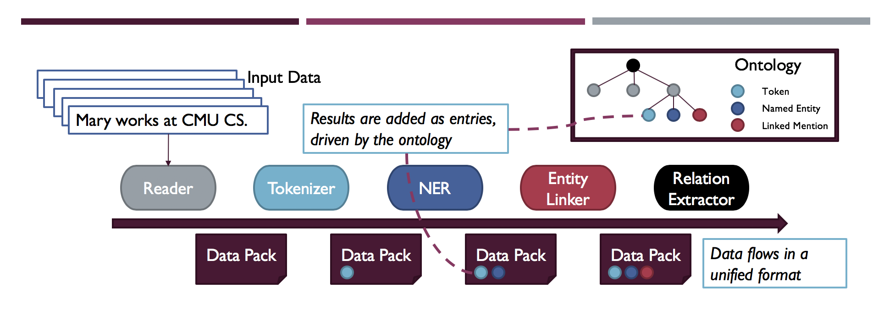
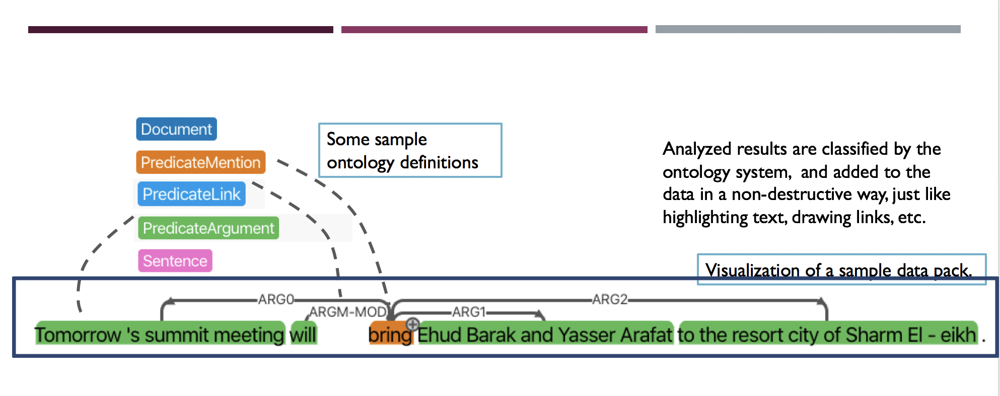

<div align="center">
   <br><br>
</div>

-----------------

[](https://travis-ci.org/asyml/forte)
[](https://codecov.io/gh/asyml/forte)
[](https://asyml-forte.readthedocs.io/en/latest/?badge=latest)
[](https://github.com/asyml/forte/blob/master/LICENSE)
[](https://gitter.im/asyml/community)


**Forte** is a toolkit for building Natural Language Processing pipelines, featuring cross-task 
interaction, adaptable data-model interfaces and many more. It provides a platform to assemble
state-of-the-art NLP and ML technologies in a highly-composable fashion, including a wide 
spectrum of tasks ranging from Information Retrieval, Natural Language Understanding to Natural 
Language Generation.  

With Forte, it is extremely simple to build an integrated system that can search documents, 
analyze and extract information and generate language all in one place. This allows the developer
to fully utilize and combine the strength and results from each step, and allow the system to 
make fully informed decision at the end of the pipeline.  

While it is quite easy to combine arbitrary 3rd party tools (Check out these [examples](./examples)!),
Forte also brings technology to you by supporting deep learning via Texar, and by providing a convenient
model data interface that allows user to cast tasks to models.

## Core Design Principles

The core design principle of Forte is the abstraction of NLP concepts and machine learning models, 
which provides better separation between data, model and tasks, but enables interactions
between different components of the pipeline. Based on this, we make Forte:

* **Composable**: Forte helps users to decompose a problem into *data*, *models* and *tasks*. 
The tasks can further be divided into sub-tasks. A complex use case 
can be solved by composing heterogeneous modules via straightforward python APIs or declarative 
configuration files. The components (e.g. models or tasks) in the pipeline can be flexibly 
swapped in and out, as long as the API contracts are matched. The approach greatly improves module 
reusability, enables fast development and makes the library flexible for user needs.
   
* **Generalizable and Extensible**: Forte promotes generalization to support not only a wide 
range of NLP tasks, but also extensible for new tasks or new domains. In particular, Forte 
provides the *Ontology* system that helps users define types according to their tasks. 
Users can simply specify the type declaratively through JSON files. Our Code Generation tool 
will automatically generate python files ready to be used into your project. Check out our 
[Ontology Generation documentation](./docs/ontology_generation.md) for more details.

* **Transparent Data Flow**: Central to Forte's composable architecture is a universal data 
format that supports seamless data flow between different steps. Forte advocates a transparent 
data flow to facilitate flexible process intervention and simple pipeline control. Combined with 
the general data format, Forte makes a perfect tool for data inspection, component swapping and 
result sharing. This is particularly helpful during team collaborations!

-----------------

<figure class="image">
   <br><br>
   <figcaption>A high level Architecture of Forte showing how ontology and entries work with the 
   pipeline.</figcaption>
</figure>

-----------------

<figure class="image">
   <br><br>
   <figcaption>Forte stores results in data packs and use the ontology to represent task logic
   </figcaption>
</figure>

-----------------

## Package Overview

<table>
<tr>
    <td><b> forte </b></td>
    <td> an open-source toolkit for NLP  </td>
</tr>
<tr>
    <td><b> forte.data.readers </b></td>
    <td> a data module for reading different formats of text data like CoNLL, Ontonotes etc 
    </td>
</tr>
<tr>
    <td><b> forte.processors </b></td>
    <td> a collection of processors for building NLP pipelines </td>
</tr>
<tr>
    <td><b> forte.trainer </b></td>
    <td> a collection of modules for training different NLP tasks </td>
</tr>
<tr>
    <td><b> ft.onto.base_ontology </b></td>
    <td> a module containing basic ontologies like Token, Sentence, Document etc </td>
</tr>
</table>

### Library API example

A simple code example that runs Named Entity Recognizer

```python
import yaml

from forte.pipeline import Pipeline
from forte.data.readers import CoNLL03Reader
from forte.processors import CoNLLNERPredictor
from ft.onto.base_ontology import Token, Sentence
from forte.common.configuration import Config


config_data = yaml.safe_load(open("config_data.yml", "r"))
config_model = yaml.safe_load(open("config_model.yml", "r"))

config = Config({}, default_hparams=None)
config.add_hparam('config_data', config_data)
config.add_hparam('config_model', config_model)


pl = Pipeline()
pl.set_reader(CoNLL03Reader())
pl.add(CoNLLNERPredictor(), config=config)

pl.initialize()

for pack in pl.process_dataset(config.config_data.test_path):
    for pred_sentence in pack.get_data(context_type=Sentence, request={Token: {"fields": ["ner"]}}):
        print("============================")
        print(pred_sentence["context"])
        print("The entities are...")
        print(pred_sentence["Token"]["ner"])
        print("============================")

```

Many more examples are available [here](./examples).

### Download and Installation

Download the repository through

```bash
git clone https://github.com/asyml/forte.git
```

After `cd` into `forte`, you can install it through

```bash
pip install .
```

### Getting started

* [Examples](./examples)
* [Documentation](https://asyml-forte.readthedocs.io/)
* And we are working one some interesting [tutorials](https://github.com/asyml/forte/wiki)


### Contributing
If you are interested in making enhancement to Forte, please quickly go over our [Code of Conduct](https://github.com/asyml/forte/blob/master/CODE_OF_CONDUCT.md) and [Contribution Guideline](https://github.com/asyml/forte/blob/master/CONTRIBUTING.md)

### License

[Apache License 2.0](./LICENSE)
