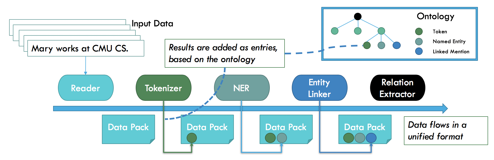
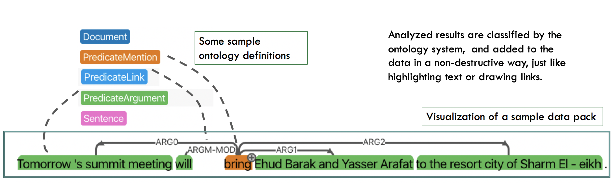

<div align="center">
   <br><br>
</div>

-----------------

[](https://travis-ci.org/asyml/forte)
[](https://asyml-forte.readthedocs.io/en/latest/?badge=latest)
[](https://github.com/asyml/forte/blob/master/LICENSE)


**Forte** is a and versatile composable toolkit for Natural Language Processing. It covers 
a wide spectrum of tasks ranging from Information Retrieval to Generation and Analysis. Forte 
provides a platform to assemble state-of-the-art NLP and ML technologies in a pipelined fashion. 
It is extremely simple to build a pipeline using tools like SpaCy, NLTK etc on Forte 
(Please refer our [examples](./examples) for more details).
These abstractions provide better separation between data, model and tasks and also loose-coupling 
between different components of the pipeline. Along with general machine learning, Forte provides 
a strong support for deep learning. With these features, Forte provides a platform to build 
customized modules to solve complex Natural Language problems.


## Core Design Principles

* **Composable**: Forte follows a structure which allows users to decompose a problem 
into data, models and tasks. The tasks can further be divided into sub-tasks. A complex use case 
can be solved by composing heterogeneous modules via straightforward python APIs or declarative 
configuration files. The components (e.g. models or tasks) in the pipeline can be flexibly 
swapped in and out, as long as the API contracts are matched. The approach greatly improves module 
reusability, enables fast development and makes the library flexible for user need.
   
* **Generalization for Extensibility**: Forte promotes generalization to support not only a wide 
range of NLP tasks, but also extensible for new tasks or new domains. In particular, Forte 
provides an extensible type system that helps users define ontologies according to their tasks. 
Users have to simply specify the type declaratively through JSON files. Our Code Generation tool 
will automatically generate python files ready to be used into your project. Check out our 
[Ontology Generation documentation](./docs/ontology_generation.md) for more details.

* **Transparent and Universal**: Central to Forte's composable architecture is a universal data 
format that supports seamless data flow between different steps. Forte advocates a transparent 
data flow to facilitate flexible process intervention and simple pipeline control. Combined with 
the general data format, Forte makes a perfect tool for data inspection, component swapping and 
result sharing.

<figure class="image">
   <br><br>
   <figcaption>A high level Architecture of Forte showing how ontology and entries work with the 
   pipeline.</figcaption>
</figure>

-----------------

<figure class="image">
   <br><br>
   <figcaption>Forte stores results in data packs and use the ontology to represent task logic
   </figcaption>
</figure>

## Package Overview

<table>
<tr>
    <td><b> forte </b></td>
    <td> an open-source toolkit for NLP  </td>
</tr>
<tr>
    <td><b> forte.data.readers </b></td>
    <td> a data module for reading different formats of text data like CoNLL, Ontonotes etc 
    </td>
</tr>
<tr>
    <td><b> forte.processors </b></td>
    <td> a collection of processors for building NLP pipelines </td>
</tr>
<tr>
    <td><b> forte.trainer </b></td>
    <td> a collection of modules for training different NLP tasks </td>
</tr>
<tr>
    <td><b> ft.onto.base_ontology </b></td>
    <td> a module containing basic ontologies like Token, Sentence, Document etc </td>
</tr>
</table>

### Library API example

A simple code example that runs Named Entity Recognizer

```python
import yaml

from texar.torch import HParams

from forte.pipeline import Pipeline
from forte.data.readers import CoNLL03Reader
from forte.processors import CoNLLNERPredictor
from ft.onto.base_ontology import Token, Sentence, EntityMention

config_data = yaml.safe_load(open("config_data.yml", "r"))
config_model = yaml.safe_load(open("config_model.yml", "r"))

config = HParams({}, default_hparams=None)
config.add_hparam('config_data', config_data)
config.add_hparam('config_model', config_model)


pl = Pipeline()
pl.set_reader(CoNLL03Reader())
pl.add_processor(CoNLLNERPredictor(), config=config)

pl.initialize()

for pack in pl.process_dataset(config.config_data.test_path):
    for pred_sentence in pack.get_data(context_type=Sentence, request={Token: {"fields": ["ner"]}}):
        print("============================")
        print(pred_sentence["context"])
        print("The entities are...")
        print(pred_sentence["Token"]["ner"])
        print("============================")

```

Many more examples are available [here](./examples).

### Download and Installation

Download the repository through

```bash
git clone https://github.com/asyml/forte.git
```

After `cd` into `forte`, you can install it through

```bash
pip install .
```

### Getting started

* [Examples](./examples)
* [Documentation](https://asyml-forte.readthedocs.io/)

### Reference

### License

[Apache License 2.0](./LICENSE)