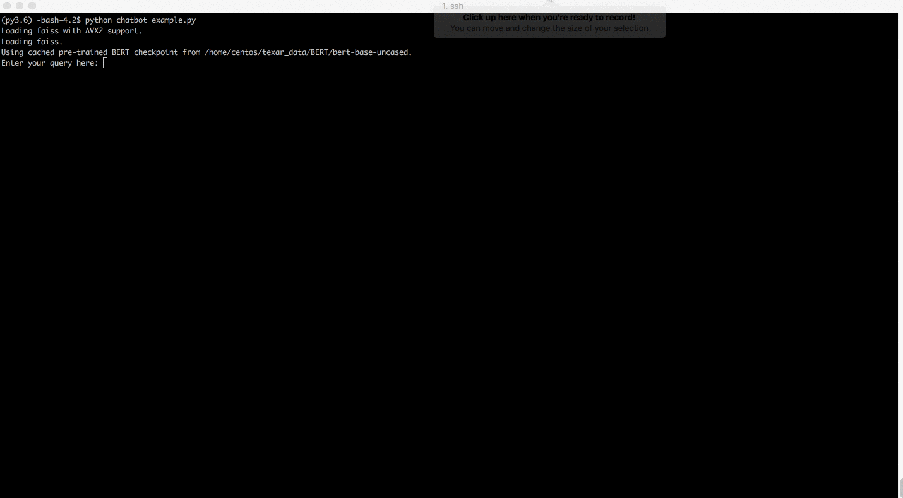

# Retrieval-based Chatbot

This example showcases the use of `Forte` to build a retrieval-based chatbot and perform text 
analysis on the retrieved results. We use the dataset released as part of this paper 
[Target-Guided Open-Domain Conversation](https://arxiv.org/abs/1905.11553). The dataset consists 
of conversations between two entities A and B. We finetune a BERT model that helps retrieve a 
response for a context.

**Note**: All the commands below should be run from `examples/indexers/` directory.

In this example, the user speaks in German and the bot extracts information stored in English. The 
bot finally translates the response to German. For text analysis, we run a *Semantic Role 
Labeler* (SRL) on the retrieved response to identify predicate mentions and arguments. Let us see a 
step-by-step guide on how to use run this example.

## Using the example in inference mode

### Downloading the models

Before we run the chatbot, we need to download the models. 

- Download chatbot model by running

```bash
python download_models.py --model-name chatbot-bert
```

- Download the index by running

```bash
python download_models.py --model-name indexer
```

- Download the SRL model by running

```bash
python download_models.py --model-name srl
```

**Note**: All the models will be saved in `model/` directory. To change the save directory use 
`--path` option in the commands above. If you change the model directory, please ensure that you 
update the path for each of the processors in `config.yml` file.

### Running the example

Now to see the example in action, just run

```bash
python chatbot_example.py
```

This starts an interactive python program which prompts for an input in German from the user. The 
program translates the input to English, retrieves the most relevant response from the corpus, 
translates it back to German and runs analysis on the output. The user can quit the program by 
pressing `Ctrl + D`.


## Training a Chatbot

We have designed this example to explain how to build train a chatbot using Forte. Follow the steps 
below

### Downloading the dataset

We use the conversation dataset used in the paper 
[Target-Guided Open-Domain Conversation](https://arxiv.org/abs/1905.11553). Refer to 
[this](https://github.com/squareRoot3/Target-Guided-Conversation) repository to download the 
dataset. The dataset consists of several conversations between two entities A and B. Download and
extract the dataset into `data/` folder

**Note**: There is a minor issue with the dataset. Particularly, on line 810, the response from B is
 missing. Hence we fix this as below

```python
sed -i '810s/.*/2 mine too ! ! ! ! ! now i can play quake and feed my dogs\tnice. do you have farms?/' source/all_none_original_no_cands.txt
```

You can use replace *"nice. do you have farms?"* with any text as long as the response is
reasonable for the conversation.
  
### Prepare the dataset

We augment each `(sentenceA, sentenceB)` pair with historical context. The contextual information 
will improve the search results. We prepare the data through the following steps

- To extract context, we augment historical information (of up to length 2) for every sentence 
pairs. i.e say the conversation is `[A1, B1], [A2, B2], [A3, B3]...` then for sentence pair 
`[A3, B3]` we create a pair using history of length 2 as `[(A1,B1,A2,B2,A3), B3]` where `(...)` 
indicates concatenation.

- We generate negative examples for each context by randomly shuffling the responses i.e. for 
sentence pair `[A,B]` we label the pair `(A,B)` as `positive` and the pair `(A, B')` as `negative` 
where `B'` is randomly picked from the pool of responses. To prepare the dataset as above, run

```bash
python prepare_chatbot_data.py
```

### Finetune BERT for chatbot dataset

We finetune BERT for sentence similarity task using the above dataset. In particular, we use a 
Siamese BERT network structure and finetune for a binary classification task. This idea is inspired 
from [Sentence-BERT: Sentence Embeddings using Siamese BERT-Networks](https://arxiv.org/abs/1908.10084). 
After this finetuning process, semantically related contexts and reponses would be geometrically 
close to each other. This finetuned model is used in the indexer to retrieve semantically meaningful
 responses. To run this finetuning,

```bash
python finetune_bert_chatbot.py
```

We finetune for 1 epoch using Adam optimizer. This process takes ~1.5 hours to train on a single 
GeForce GTX 1080 Ti with 11GB of GPU memory. After 1 epoch, test accuracy should be around `80%`.

### Download SRL model

The training process above does not train an SRL model. Hence we download it as below

```bash
python download_models.py --model-name srl
```

### Run the model

Now that you have trained the model, run

```bash
python chatbot_example.py
```

to see your chatbot in action.

Below is sample run of the chatbot example 

## Temporary settings


The machine translation processor currently uses Bing APIs to perform the translation Please set the
following environment variable to use the processor

```
export MICROSOFT_API_KEY=<YOUR_MICROSOFT_KEY>
```