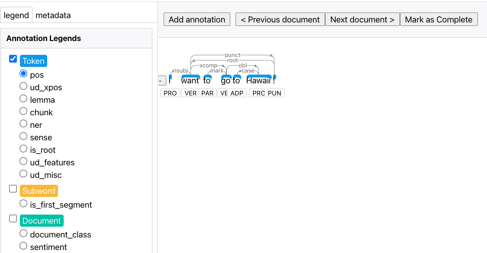

# Running the example

## Install some wrappers for the example.

```bash
# Install huggingface
pip install "git+https://git@github.com/asyml/forte-wrappers.git#egg=forte.huggingface&subdirectory=src/huggingface"
# Install stanze
pip install "git+https://git@github.com/asyml/forte-wrappers.git#egg=forte.stanza&subdirectory=src/stanza"
# Install stave
pip install stave
```

Try starting the script with the following:

```bash 
python visualize.py
```

(After a ton of downloading) A web browser will pop up to show the results. You can enter sentence in the terminal prompt.

The visualization example looks like the following:



You may find a new folder named `Auto generated project` created under your working directory. This is the Stave project that is saved by [StaveProcessor](https://github.com/asyml/forte/blob/master/forte/processors/stave/stave_processor.py#L46). You can import this folder into the Stave backend database by running
```bash
stave -s import Auto\ generated\ project/
```
Note that you will be prompted to enter your username(admin) and password(admin) before moving forward.

After it's saved to backend database, you can check out this project by starting a Stave server:
```bash
stave start -o
```
Again, you will need to log in with your username and password in order to view the project.

For more instructions of how to use Stave command line tool, refer to https://github.com/asyml/stave/blob/master/README.md.